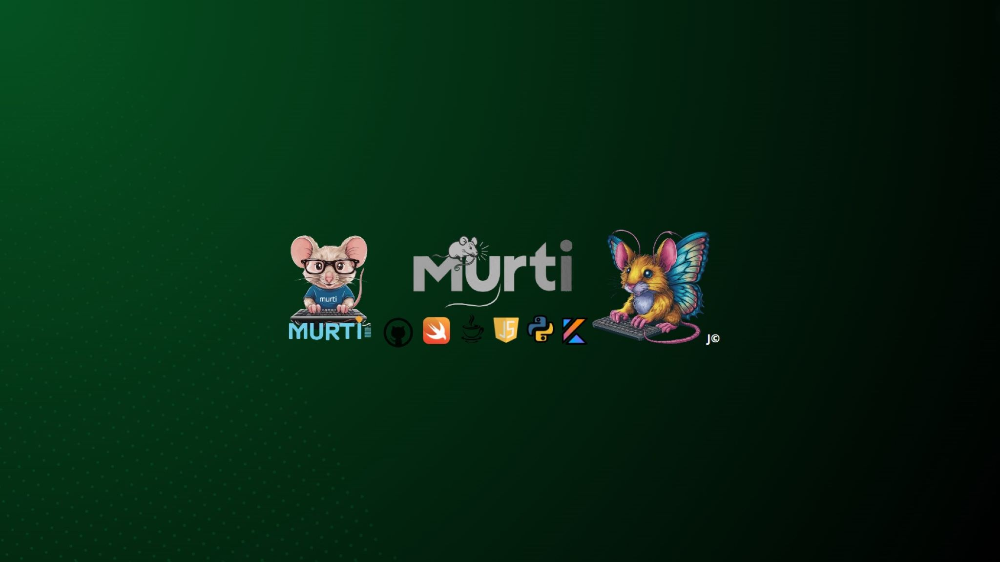

#  Hola, mi nombre es Jc Murti 👋
### Software Developer | Kotlin, Java, Swift, Python, JS, Oracle, XML, Git, ERP

🔸Apasionado en el aprendizaje de todo tipo de lenguajes de programación y herramientas.
Especial interés en IA y Ciberseguridad.

## Encuéntrame en:
![(https://youtube.com/@MurtiDeveloper]
<!--
**MurtiDev/MurtiDev** is a ✨ _special_ ✨ repository because its `README.md` (this file) appears on your GitHub profile.

Here are some ideas to get you started:

- 🔭 I’m currently working on ...
- 🌱 I’m currently learning ...
- 👯 I’m looking to collaborate on ...
- 🤔 I’m looking for help with ...
- 💬 Ask me about ...
- 📫 How to reach me: ...
- 😄 Pronouns: ...
- ⚡ Fun fact: ...
-->
